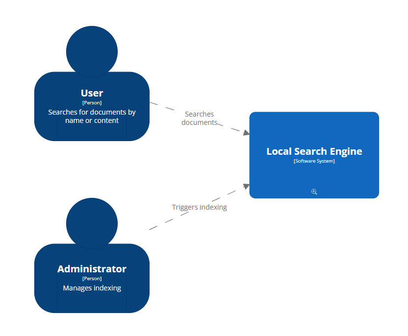
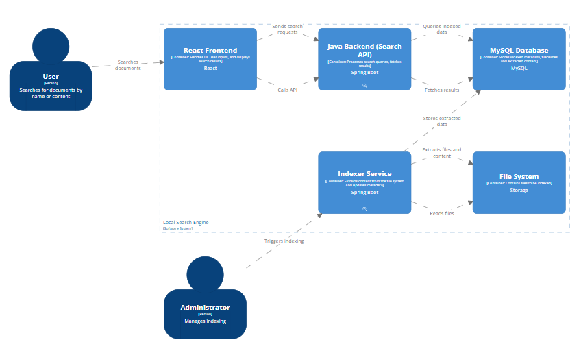
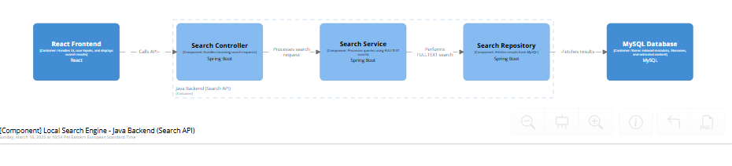
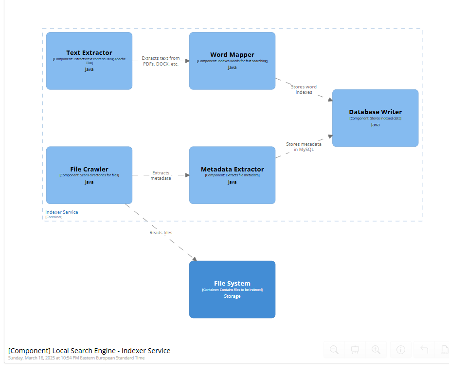

# ARCHITECTURE

## Project Overview
The **Local Search Engine** is a web-based system designed to index and search files stored on a local file system. The system enables users to search not only by filename but also by the content within the files. It is built using a **React frontend**, a **Spring Boot backend**, and a **MySQL database** with full-text search capabilities.

## Functional & Non-Functional Requirements
### **Functional Requirements**
* Index local files (documents, media, binaries).
* Support filename and full-text content search.
* Provide real-time search results as the user types.
* Display file previews (first few lines of content).
* Allow administrators to configure indexing parameters.

### **Non-Functional Requirements**
* **Performance**: Fast and responsive searches using full-text indexing.
* **Scalability**: Handles large numbers of files efficiently.
* **Reliability**: Ensures database integrity and fault tolerance.
* **Security**: Protects access to indexed data and search APIs.
* **Extensibility**: Supports additional file formats in the future.
  
## Architectural Model
This project follows the **C4 Model**, which provides a structured way to describe the system architecture across multiple levels of abstraction.

### **1. Context Level**

At the highest level, the system involves two main actors:
- **Users**: Search for files using the web interface.
- **Administrators**: Manage indexing configurations.

The **Local Search Engine** consists of:
- **React Frontend**: A web-based UI for users to perform searches.
- **Java Backend (Spring Boot)**: Handles search requests and processes queries.
- **Indexer Service**: Extracts metadata and content from files.
- **MySQL Database**: Stores indexed data and supports full-text search.
- **File System**: Contains the files to be indexed.

### **2. Container Level**

The system is composed of the following containers:

#### **Frontend (React Web Application)**
- Provides a search interface.
- Sends user queries to the backend via REST API.
- Displays search results in real-time.

#### **Backend (Spring Boot API)**
- Exposes REST endpoints for searching.
- Processes queries using full-text search in MySQL.
- Communicates with the Indexer Service and the database.

#### **Indexer Service**
- Scans directories and extracts file metadata and content.
- Uses **Apache Tika** for content extraction from multiple file formats.
- Stores extracted information in the MySQL database.

#### **Database (MySQL)**
- Stores indexed files, metadata, and extracted content.
- Uses **FULLTEXT indexes** to efficiently search file content.

### **3. Component Level**
The key components in the system include:

#### **Backend Components**

- **Search Controller**: Handles search API requests.
- **Search Service**: Processes queries and interacts with the repository.
- **Search Repository**: Uses MySQL's full-text search for querying results.

#### **Indexer Components**

- **File Crawler**: Scans directories for new or modified files.
- **Metadata Extractor**: Extracts file metadata (e.g., size, type, timestamps).
- **Text Extractor**: Extracts textual content from files.
- **Database Writer**: Stores indexed data in MySQL.

## Indexing Mechanism
The **indexing process** consists of the following steps:
1. **File Discovery**: The Indexer Service scans the local file system.
2. **Metadata Extraction**: Extracts file type, size, creation date, etc.
3. **Content Extraction**: Extracts textual content from supported formats.
4. **Word Mapping**: Stores extracted text in a format optimized for search.
5. **Database Storage**: Saves metadata and indexed content into MySQL.

---
**Note:** Above, images of the generated C4 model diagram at each level should be placed to visually represent the architecture. The DSL code of the diagram will be included in the `docs/` folder of the main project.
